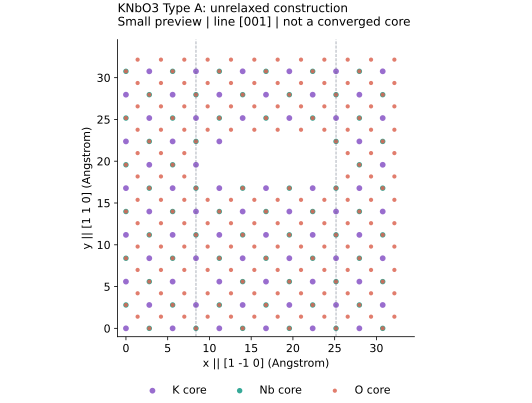

# KNbO3 Dislocations in LAMMPS

**An open research collaboration to adapt Type A-E dislocation geometries to KNbO3 using a polarizable core-shell model.**

The structural reference is Klomp, Porz and Albe's study of dislocations in **SrTiO3**. Our target material is **KNbO3**. We aim to construct and validate the five geometries, then investigate core structure, dissociation, stability and mobility. The paper uses fixed effective ionic charges; these KNbO3 models use a core-shell description. Similar geometry does not imply identical material behavior.

**Start here:** [small Type A example](docs/QUICKSTART.md) · [model status](docs/STATUS.md) · [contribution guide](CONTRIBUTING.md) · [open tasks](https://github.com/yhj114548/KNbO3-dislocation/issues)



*A small geometry preview built from the supplied Type A builder. This is an initial structure, not a relaxed core or a measured result.*

## Try a small example

```bash
git clone https://github.com/yhj114548/KNbO3-dislocation.git
cd KNbO3-dislocation
python3 -m venv .venv
source .venv/bin/activate
python -m pip install numpy
python examples/type_a_preview.py
```

This creates 1,320 particles (660 core-shell pairs) in `runs/type-a-preview/CONFIG.A`. Open it in OVITO, or follow the [optional LAMMPS initial-force check](docs/QUICKSTART.md). The tiny cell is for inspecting the workflow, not quantitative dislocation physics.

## Help wanted

Experienced atomistic researchers and contributors improving documentation or analysis tools are welcome.

- **Core-shell validation:** charges, masses, springs, potential provenance, temperature/pressure definitions and timestep convergence.
- **Crystallography:** Burgers circuits, line directions, slip planes, periodic dipoles and local core stoichiometry.
- **Input recovery:** restore unreadable Type B source files from a known-good copy.
- **Reproducibility:** document runs and develop OVITO/Python visualization workflows.

Pick a task in [Issues](https://github.com/yhj114548/KNbO3-dislocation/issues), comment with your approach, and submit a focused pull request. Small, documented contributions are useful.

## Files and provenance

| Location | Contents |
| --- | --- |
| `models/A` to `models/E` | Available UTF-8 source/input files extracted from the archives for direct review |
| `models/reference` | Small input files from the 20260205 baseline archive |
| `examples` | Small Type A construction and initial-force check |
| `docs/archive-audit.json` | Archive hashes, byte-preserved source provenance and unreadable entries |
| Root ZIP archives | Original packages, available large configurations and historical output |

Extracted sources retain their original bytes and parameters. Large generated `CONFIG.*` files remain in their archives where supplied. Historical output does not prove that current inputs have converged. The PDF is not currently present in the repository; use the publication link below.

## Current status

This is an early-stage research project. A small geometry and initial-force check are reproducible; a validated Type A-E production benchmark is still a goal.

- A and C have recorded static-preparation failures before MD.
- D has a recorded static failure and its archive omits `CONFIG.D`.
- B contains 13 small entries filled with `0xFF` bytes; recovery is required.
- E includes an older stabilization protocol needing independent review.

See [STATUS](docs/STATUS.md) for evidence and limits. Converged dislocation energies, polarization changes and Peierls stresses are not yet established.

## Reference and citation

A. J. Klomp, L. Porz and K. Albe, *The nature and motion of deformation-induced dislocations in SrTiO3: Insights from atomistic simulations*, Acta Materialia **242** (2023), 118404. [DOI](https://doi.org/10.1016/j.actamat.2022.118404).

See [CITATION.cff](CITATION.cff) to cite this repository. Cite the paper separately when using its classification or methodology.

## Reuse

A code license has not yet been selected. Discuss reuse and licensing with the maintainer in an Issue. Third-party papers and potential parameter sources retain their own terms and attribution requirements.
